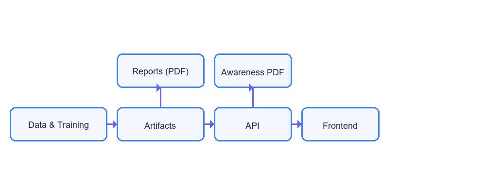

# BreastAI — Breast Cancer Prediction and Awareness (FastAPI + Next.js)

BreastAI turns a Jupyter-style experiment into a reproducible pipeline, an API that streams plots and PDFs, and a modern dark-themed web app. It includes a “Getting Started” learning page, awareness PDFs (multi-language), and optional deep learning — all wired end-to-end.

Highlights
- Reproducible training (scikit-learn) with stacked models and metadata export
- FastAPI backend that streams on-demand PDFs (prediction report + awareness guide)
- Next.js frontend with a dark purple theme, accessible content, and embedded videos
- Optional TensorFlow deep-learning path with lazy runtime detection
- Smooth UX: auto-open prediction report, reliable downloads, and print styles

Repository layout (top level)
- `train_model.py` — Train & export sklearn pipeline and metadata
- `train_dl.py` — Optional Keras MLP training for tabular data
- `app/main.py` — FastAPI app (predict, report, awareness, models, sample)
- `frontend/` — Next.js site (Home, Learn, Demo) with Tailwind styling
- `generate_pdf.py` — Builds a sample/report PDF for homepage download
- `artifacts/` — Saved plots (ROC/PR/Confusion/SHAP), classification report
- `model_pipeline.joblib`, `model_pipeline_stacking.joblib`, `model_metadata.json` — artifacts
- `dl_model.h5` — optional deep learning model
- `requirements.txt` — Python deps (ReportLab pinned for reliable PDFs)

## Quick start (Windows PowerShell)

Backend API
```powershell
python -m venv .venv
.venv\Scripts\Activate.ps1
pip install -r requirements.txt
python -m uvicorn app.main:APP --reload --port 8000
```

Frontend (Next.js)
```powershell
cd frontend
npm install
npm run dev
```

Open http://localhost:3000 and try:
- Launch Demo → enter or load sample values → prediction → report auto-opens
- Getting Started → visual guide with i18n and awareness PDF download

## Project workflow (end-to-end)

1) Data & Training
- Load `data.csv`; clean columns (drop id/unnamed); stratified split
- Preprocess: imputer → scaler → SelectKBest (k tuned)
- Train candidate models; GridSearchCV; export best pipeline and `model_metadata.json`
- Optional: train a DL MLP; persist `dl_model.h5` and a consistent scaler

2) API (FastAPI)
- Lazy-load artifacts; detect DL runtime (no heavy TF import at startup)
- `/predict` validates input and returns prediction and probability
- `/report` streams a per-prediction PDF with plots and metrics
- `/awareness` serves a daily-cached multilingual awareness PDF
- `/models` reports available models and whether DL is runnable
- `/sample` returns a canonical feature vector for quick demos

3) Frontend (Next.js)
- Home: feature highlights and an awareness spotlight video
- Learn: “Getting Started” guide with visuals, FAQs, and PDF download
- Demo: inputs, model selector (sklearn/stacking/DL), SHAP toggle; opens PDF
- Smooth scrolling and fade-in animations; downloads via robust proxying

4) Reports & PDFs
### ASCII Workflow Diagram

```
┌───────────────┐      ┌──────────────┐      ┌────────┐      ┌──────────┐
│  Data & Train │ ───▶ │  Artifacts   │ ───▶ │  API    │ ───▶ │ Frontend │
│ (train_model) │      │ (models,     │      │ (predict│      │ (Home /  │
│               │      │  metadata,   │      │  report │      │  Demo /  │
│  train_dl opt)│      │  plots)      │      │  aware) │      │  Learn)  │
└──────┬────────┘      └──────┬───────┘      └────┬───┘      └─────┬────┘
	   │                      │                  │               │
	   │                      │                  │               │
	   ▼                      ▼                  ▼               ▼
   Reports (PDF) <────────────┘          Awareness PDF (cached per lang/day)
```



The same diagram is exported as `artifacts/workflow.png` and embedded into the generated PDF.

- Prediction report: generated on-demand via `/report` (streamed PDF)
- Awareness guide: multi-language PDF with inline vector illustrations; cached per day
- Sample static PDF: built by `generate_pdf.py` for homepage download

## API reference (dev URLs)
- GET `http://127.0.0.1:8000/health`
- POST `http://127.0.0.1:8000/predict`  Body: `{ "features": [x1..x30], "model_type": "sklearn|stacking|dl", "explain": bool }`
- POST `http://127.0.0.1:8000/report`
- GET `http://127.0.0.1:8000/awareness?lang=en|hi|mr`
- GET `http://127.0.0.1:8000/models`
- GET `http://127.0.0.1:8000/sample`

## Deep learning (optional)
TensorFlow isn’t imported at startup: the backend checks runtime availability and model file presence before enabling the DL option. To enable DL locally:
```powershell
pip install tensorflow-cpu
python train_dl.py
```

## Generate a sample report PDF
```powershell
python generate_pdf.py
```
This creates `report.pdf` (the homepage “Download Example Report”). It summarizes metrics, configuration, model comparison, plots, key findings, technical details, and clinical implications. It now also includes a “Project Workflow” section.

## Tests
```powershell
python test_report.py
python -m pytest -q  # if you add more tests
```

## Troubleshooting
- Awareness PDF returns 404 in dev: ensure Next.js dev rewrite maps `/api/awareness` → backend `/awareness` and that the API is running on port 8000.
- Deep learning disabled: check `/models` — DL requires both `dl_model.h5` and a TF runtime.
- Blank plots in reports: make sure `artifacts/*.png` exist; rebuild by re-running training.

## License and disclaimer
This repository is for educational purposes. It does not provide medical advice.

